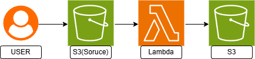

# Lecture36 - AWS Lambda 
## 課題内容
Lambdaを活用したバックエンド処理を実装。

## 実施内容
- チュートリアル①:最初の Lambda 関数を作成する
- チュートリアル② Amazon S3 トリガーを使用して Lambda 関数を呼び出す
- チュートリアル③ Amazon S3 トリガーを使用してサムネイル画像を作成する
- チュートリアル④: API Gateway で Lambda を使用する ← 追加（推奨課題）

## 構成図

## スクリーンショット
### チュートリアル①

### チュートリアル②③ S3トリガー

### チュートリアル④（推奨課題） API Gateway + Lambda + DynamoDB

