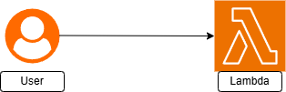
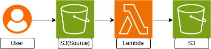
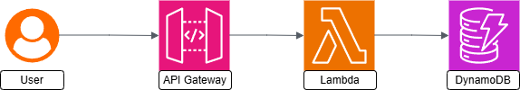
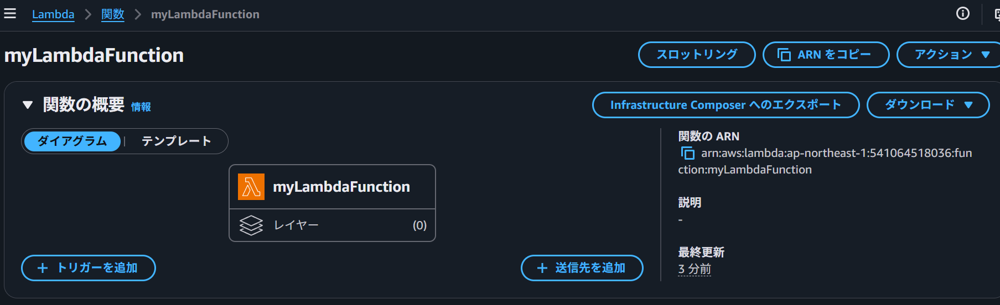
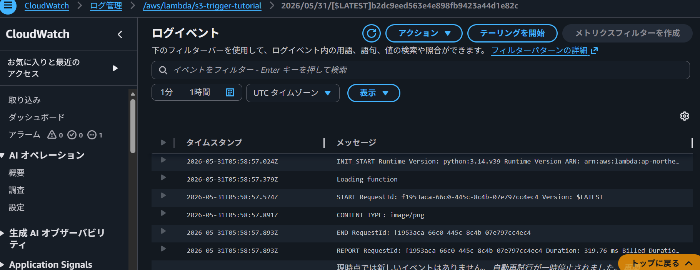
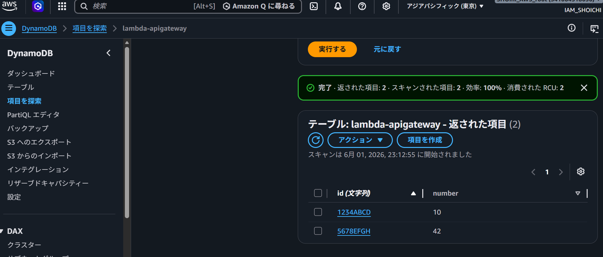
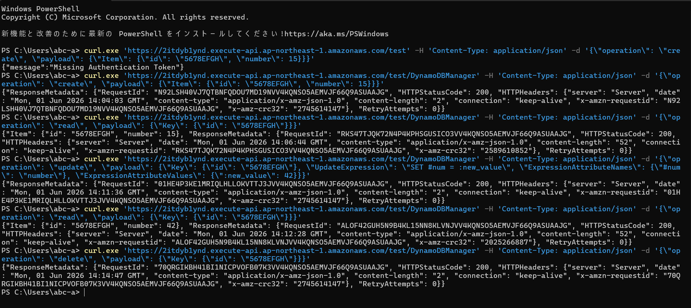

# Lecture36 - AWS Lambda 

## 課題内容

Lambdaを活用したバックエンド処理を実装。

## 実施内容

- チュートリアル①:最初の Lambda 関数を作成する(課題)
- チュートリアル② Amazon S3 トリガーを使用して Lambda 関数を呼び出す
- チュートリアル③ Amazon S3 トリガーを使用してサムネイル画像を作成する
- チュートリアル④: API Gateway で Lambda を使用する (推奨課題)

## 構成図

### チュートリアル①(構成図)

### チュートリアル②③ S3トリガー(構成図)

### チュートリアル④（推奨課題） API Gateway + Lambda + DynamoDB(構成図)

## 関数説明

### チュートリアル①(関数)

**ファイル：** `src/tutorial01/lambda_function.py`  
**ランタイム：** Python 3.14  
**ハンドラ：** lambda_function.lambda_handler  

**処理内容：**  
縦（length）と横（width）を受け取り、
掛け算した面積の数値を返す関数。

### チュートリアル②(関数)

**ファイル：** `src/tutorial02/lambda_function.py`  
**ランタイム：** Python 3.14  
**ハンドラ：** lambda_function.lambda_handler  

**処理内容：**  
S3のバケット名とファイル名を受け取り、S3からファイルを取得してコンテンツタイプを識別し、コンテンツタイプを返す関数。

### チュートリアル③(関数)

**ファイル：** `src/tutorial03/lambda_function.py`  
**ランタイム：** Python 3.12　(ランタイムとライブラリのバージョンを合わせた)  
**ハンドラ：** lambda_function.lambda_handler  

**処理内容：**  
 ソース元S3のバケット名とファイル名を受け取り、ファイル画像サイズを2分の1に変換し、別のS3バケットにアップロードする関数。

### チュートリアル④(関数)

**ファイル：** `src/tutorial04/lambda_function.py`  
**ランタイム：** Python 3.14  
**ハンドラ：** lambda_function.lambda_handler  

**処理内容：**  
 HTTPリクエストからoperationとpayloadを受け取り、operationに対応したCRUD関数をDynamoDBに実行し、ターミナルに返す。

## IAMロール／ポリシー

### チュートリアル①(IAMロール／ポリシー)

- CloudWatch Logs書き込み権限

### チュートリアル②(IAMロール／ポリシー)

- CloudWatch Logs書き込み権限
- S3読み取り権限（GetObject / ListBucket）

### チュートリアル③(IAMロール／ポリシー)

- CloudWatch Logs書き込み権限
- S3読み取り権限（GetObject / ListBucket）
- S3書き込み権限（PutObject）

### チュートリアル④(IAMロール／ポリシー)

- CloudWatch Logs書き込み権限
- DynamoDB CRUD操作権限

## 動作検証

### チュートリアル①(動作検証)

### チュートリアル②③ S3トリガー(動作検証)

### チュートリアル④（推奨課題） API Gateway + Lambda + DynamoDB(動作検証)

## 無限再帰防止

### 無限再帰防止（チュートリアル③）

**問題：**
トリガーをサムネイル保存先バケットに設定すると、
アップロード → トリガー作動 → サムネイル作成 → アップロード
の無限ループが発生する。

**対策：**
ソースバケットとサムネイル保存先バケットを別々に作成し、
トリガーはソースバケットのみに設定する。
