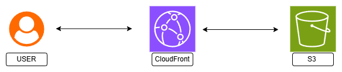

# CloudFront課題
CloudFrontを使った簡単なサービスを構築。
- HTMLファイルをCloudFrontを経由で公開する。
- AIを活用して少し凝ったWEBサイトを作成し、CloudFrontを経由で公開する。

## 構成図

- ユーザー　→　CloudFront　→　S3　→　CloudFront　→　ユーザー

## 使用サービス
- CloudFront
- S3

## 学んだこと
- CloudFront概要及びコンソール操作でのディストリビューション作成、公開までの手順。
- CloudFrontの仕組みと役割。
- OACによるS3保護。
- Default root object設定。
- リソース削除の手順。

## 詰まったポイントと解決策
講義動画とドキュメントの手順があり作成手順は同じように進めればいいはずの課題でしたが、コンソール画面が大幅に変わっていた（ドキュメント手順も違う）ので自力で進めていく必要があり想定より時間がかかりました。
それでもキーワードを探り進めていけました。AWS無料期間が終了していてコストがかかる選択を避けたかったため、翻訳しながら必要ないものは選択しないように調べながら進めることができ理解が深まりました。
