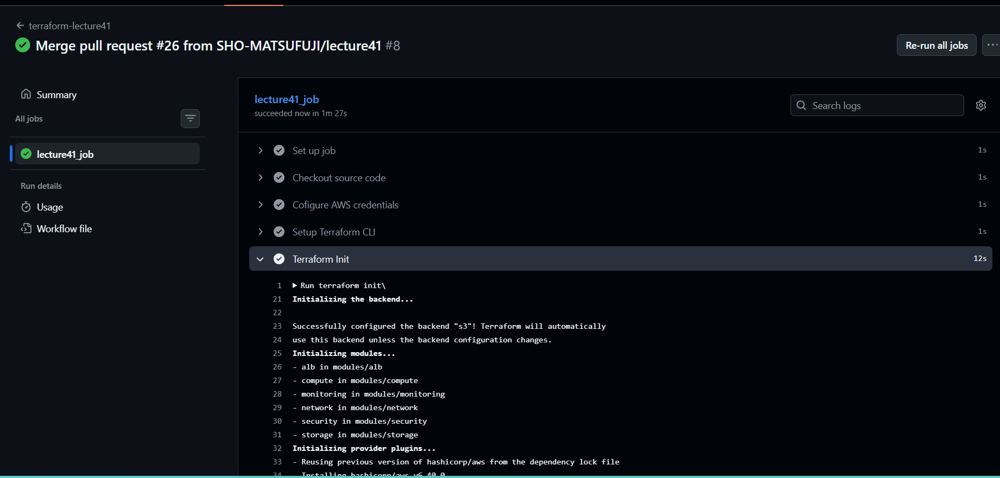
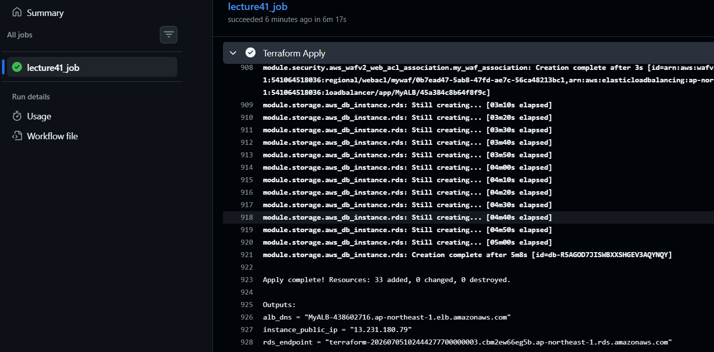
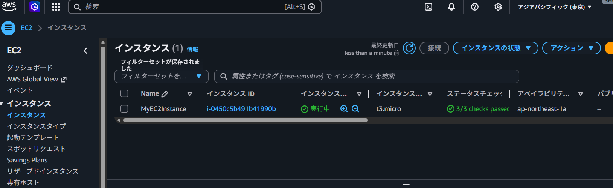
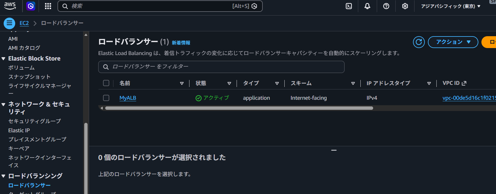
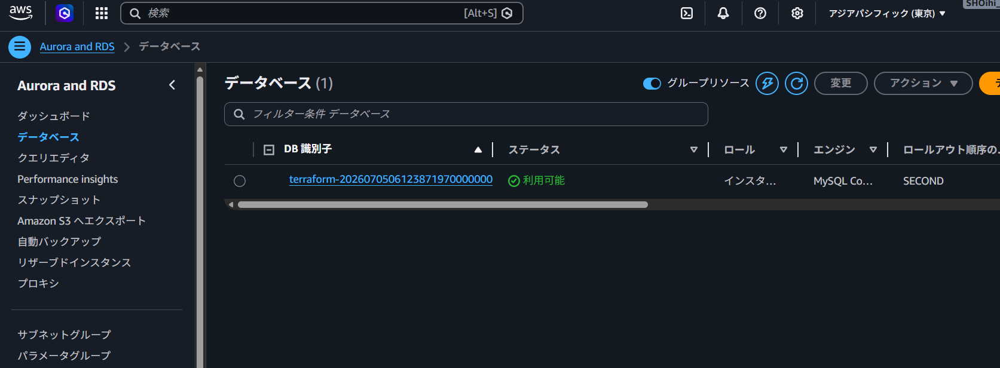
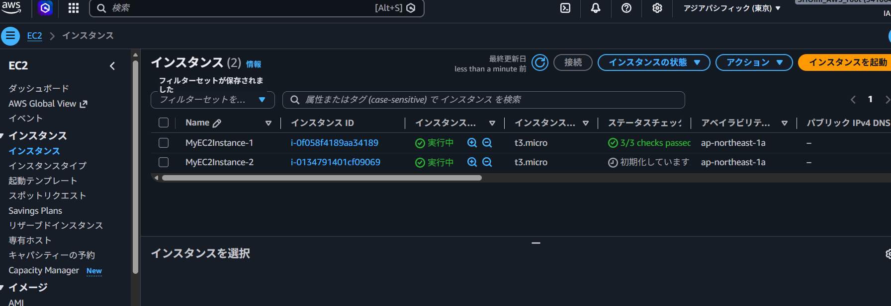

# Lecture41 CI/CD環境構築 ～GithubActions～

## 概要

GitHub Actionsを利用して、TerraformによるAWSインフラ構築の検証（CI）から自動デプロイ（CD）までを行うパイプラインの構築リポジトリです。

## 実装内容

AWSインフラ環境(EC2+RDS+ALB)のEC2インスタンス1台から2台に増設し、CI/CD実行しました。  
`.github/workflows/` 内のYAMLファイルにて、以下のステップを実装しています。

1. **Checkout source code** (`actions/checkout@v4`)
       - ワークフローを実行するランナー環境に、リポジトリのソースコードをチェックアウト
2. **Configure AWS credentials** (`aws-actions/configure-aws-credentials@v4`)
       - OIDC認証による安全なAWS接続と認証情報の取得
3. **Setup Terraform CLI** (`hashicorp/setup-terraform@v3`)
       - ランナー環境に指定バージョンのTerraform CLIをインストールする
4. **Terraform Init**
       - Terraformプロバイダプラグインのダウンロードとバックエンド（tfstate管理）の初期化
5. **Terraform Plan**
       - 現在のインフラ状態とコードを比較し、追加・変更・削除されるリソースの計画差分を出力
6. **Terraform Test（CI）**
       - コードの変更に対するテストの自動実行
7. **Terraform Apply（CD）**
       - mainブランチへのマージをトリガーとした自動デプロイ

### 動作環境

- **CI/CDツール:** GitHub Actions (Runner: `ubuntu-latest`)
- **IaC:** Terraform v1.14.7

## ファイル構成

- **ワークフローファイル:** `.github/workflows/terraform_lecture41.yaml`
- **Terraformコード:** `terraform-test-lecture40/`

## 工夫した点

- **セキュリティの考慮　OIDC(OpenID connect)による認証とGitHub Secretsにより値を隠す**  
アクセスキーやシークレットアクセスキーを使用せずに、OIDC認証を使用しました。認証情報の漏洩リスクを最小限に抑えたベストプラクティスとなり、さらに、AWSアカウントID含むロールARNはハードコーディングせず、GitHub Secretsに変数化して管理することで、セキュリティの安全性を高めています。

## OIDC設定手順

GitHub ActionsとAWSを安全に連携させるため、以下の初期設定を行っています。

### 1. AWS側の設定(IAM)

- **プロバイダ登録**: GitHub用のOIDCプロバイダ（`https://githubusercontent.com`）を作成  
- **IAMロール作成**: Terraform実行用の権限を付与したロール（`terraform-CICD-lecture41`）を作成

### 2. GitHub側の設定(Secrets)

`AWS_ROLE_ARN`: 作成したIAMロールのARNをGithubリポジトリのSecretsに登録(ARNにAWSアカウントIDが含まれるのでハードコーディングではなくSecretsで隠す)

## スクリーンショット（動作確認）

### CI/CD パイプライン

### AWS　構築リソース

